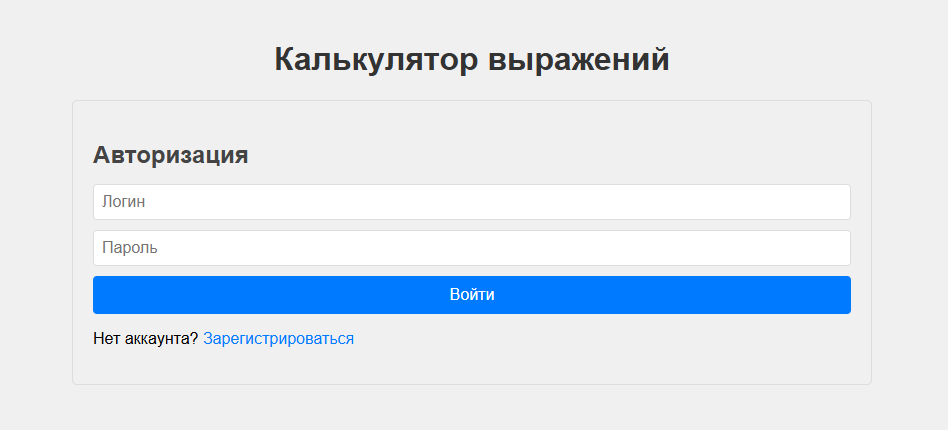
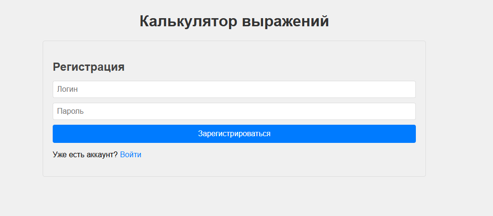
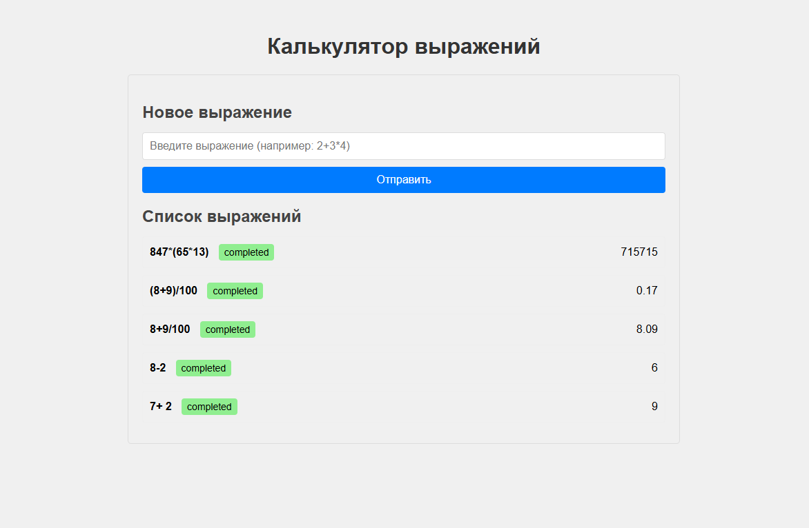

# Calc Service

Calc Service - это веб-сервис для распределённых вычислений, который позволяет выполнять арифметические выражения в многопользовательском режиме. Сервис использует архитектуру, состоящую из оркестратора и агентов, для эффективного выполнения задач.

## Адрес сервиса

Сервис доступен по адресу: [http://localhost:8080](http://localhost:8080)

## Инструкция по запуску

1. **Убедитесь, что установлен Go** (версии 1.20 или выше).

2. **Установите GCC**:
   - Для Windows: Скачайте и установите MinGW-w64 с официального сайта по [инструкции](https://programforyou.ru/poleznoe/kak-ustanovit-gcc-dlya-windows?ysclid=majlp37z7w118007909).

3. **Настройте переменную окружения CGO_ENABLED**:
   - Установите переменную окружения `CGO_ENABLED=1` для включения поддержки CGO:
     ```bash
      go env -w CGO_ENABLED=1
     ```

4. **Установите Protocol Buffers Compiler (protoc)**:
   - Скачайте последнюю версию protoc для Windows: [protoc-25.1-win64.zip](https://github.com/protocolbuffers/protobuf/releases/download/v25.1/protoc-25.1-win64.zip)
   - Распакуйте содержимое архива в папку `tools\protoc` проекта
   - В результате должна появиться структура:
     ```
     tools/
     └── protoc/
         ├── bin/
         │   └── protoc.exe
         └── include/
     ```

5. **Установите Go плагины для protoc**:
   ```bash
   go install google.golang.org/protobuf/cmd/protoc-gen-go@latest
   go install google.golang.org/grpc/cmd/protoc-gen-go-grpc@latest

6. **Скачайте зависимости проекта**:
   ```bash
   go mod tidy
   ```

7. **Запустите оркестратор**:
   ```bash
   go run ./cmd/orchestrator/...
   ```
   Оркестратор запустит:
   - HTTP-сервер на порту 8080 (для веб-интерфейса)
   - gRPC-сервер на порту 50051 (для общения с агентами)

8. **Запустите агент (в отдельном окне терминала)**:
   ```bash
   go run ./cmd/agent/...
   ```
9. **Откройте веб-интерфейс**:
    - Перейдите по адресу [http://localhost:8080](http://localhost:8080) в браузере.
    - Пройдите авторизацию.






  - Введите арифметическое выражение и нажмите "Отправить".




## Эндпоинты API

Сервис предоставляет следующие эндпоинты:
- `POST /api/v1/register` - регистрация нового пользователя.
- `POST /api/v1/login` - авторизация пользователя.
- `POST /api/v1/calculate` - отправка выражения на вычисление.
- `GET /api/v1/expressions` - получение списка выражений.
- `GET /api/v1/expressions/:id` - получение выражения по ID.

## gRPC API

Сервис предоставляет следующие gRPC методы:
- `GetTask` - получение задачи для вычисления.
- `SubmitResult` - отправка результата вычисления.

## Переменные окружения

Для настройки времени выполнения операций можно задать следующие переменные окружения:
- `TIME_ADDITION_MS` - время выполнения сложения (мс).
- `TIME_MULTIPLICATIONS_MS` - время выполнения умножения (мс).
- `TIME_SUBTRACTION_MS` - время выполнения вычитания (мс).
- `TIME_DIVISIONS_MS` - время выполнения деления (мс).

Пример настройки (Windows):
```bash
set TIME_ADDITION_MS=1000
set TIME_MULTIPLICATIONS_MS=2000
set TIME_SUBTRACTION_MS=1000
set TIME_DIVISIONS_MS=3000
```
## Покрытие кода

Unit-тесты (модульные) расположены в файлах:
- `internal/orchestrator/handlers_test.go`
- `internal/orchestrator/parser_test.go`
- `internal/orchestrator/storage_test.go`
- `internal/agent/client_test.go`

Интеграционные тесты расположены в файлах:
- `tests/agent_test.go`
- `tests/integration_test.go`
- `tests/parser_test.go`


## Примеры использования API
````bash
POST http://localhost:8080/api/v1/register
Content-Type: application/json

{"login":"test1","password":"test1234"}

###

POST http://localhost:8080/api/v1/login
Content-Type: application/json

{"login":"test1","password":"test1234"}

###

POST http://localhost:8080/api/v1/calculate
Content-Type: application/json
Authorization: Bearer <полученный.токен>

{"expression":"2 + 3 * 4"}
````
### Curl

```bash
curl -X POST http://localhost:8080/api/v1/register \
  -H "Content-Type: application/json" \
  -d '{"login":"test1","password":"test1234"}'
  
###

curl -X POST http://localhost:8080/api/v1/login \
  -H "Content-Type: application/json" \
  -d '{"login":"test1","password":"test1234"}'
  
###

curl -X POST http://localhost:8080/api/v1/calculate \
  -H "Content-Type: application/json" \
  -H "Authorization: Bearer <полученный.токен>" \
  -d '{"expression":"2 + 3 * 4"}'
```
